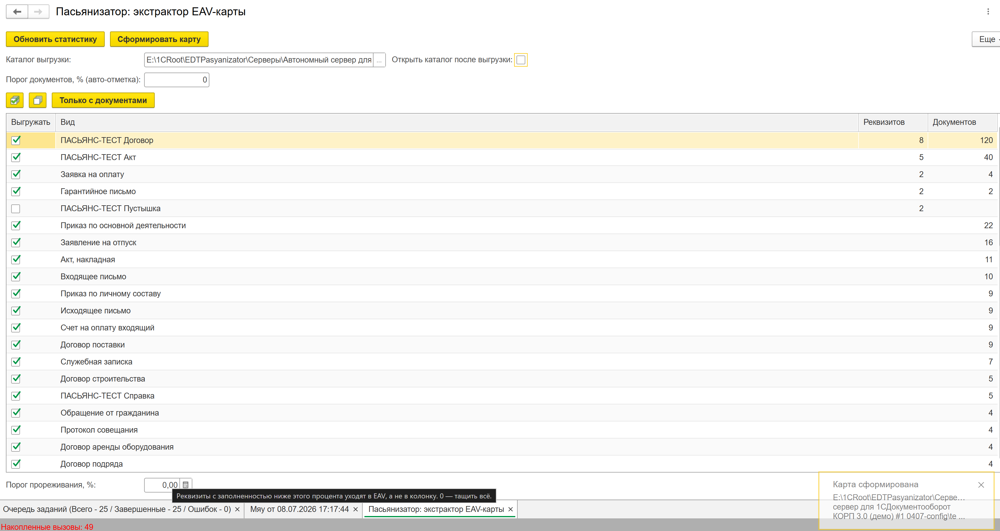

# Пасьянизатор

**Автоматическая декомпозиция EAV-монолита 1С:Документооборот КОРП 3.0 в физические
`Catalog.<Вид>` — конвейер «карта → генерация → гейты → накат», собранный ИИ-агентом.**

> Пасьянс сошёлся: боевая конфигурация ДО 3.0 отдала ровно **52 вида документов** (полную колоду
> карт), и конвейер разложил их все в физические справочники — с гарантией целостности через гейты,
> без единой ошибки реструктуризации.

---

## Проблема: EAV-монолит

В 1С:Документооборот КОРП 3.0 **все** виды документов (договоры, приказы, счета-фактуры, служебные
записки, трудовые договоры…) физически лежат в ОДНОМ справочнике `ДокументыПредприятия`, а их
различия — в доп.реквизитах и доп.сведениях через механизм свойств БСП (EAV: Entity-Attribute-Value).

Гибко для внедренца, смертельно для SQL-сервера: любой отбор по доп.реквизиту в динамическом списке
превращается в скрытый тяжёлый `LEFT JOIN` к гигантской таблице свойств. На больших базах это роняет
`rphost` и раздувает transaction log.

## Решение: разложить монолит в физику

Пасьянизатор снимает с живой базы **карту** (нормативный JSON-контракт — по сути vendor-neutral AST
бизнес-логики), затем генерирует физические `Catalog.<Вид>` со статическими SQL-колонками, врезает их
типы во все обязательные составы ядра (маршрутизация, права, регистры), мигрирует данные из EAV в
колонки — **автоматически, идемпотентно, с гарантией целостности через гейты**.

```
[Экстрактор в 1С] --JSON-карта--> [PowerShell-конвейер: генерация + якорная врезка + предохранители]
   --накат--> [физические Catalog.<Вид>] --миграция EAV→колонки--> [гейты: контракт / типозамкнутость / смоук]
```

## Результат (заводская репетиция)

| Метрика | Значение |
|---------|----------|
| Видов документов декомпозировано | **52** (вся боевая демо-конфигурация) |
| Физических `Catalog.<Вид>` сгенерировано | 52 |
| Вставок типов в составы ядра (якорная врезка) | **6500** в 112 составов, 0 промахов |
| Коллизий имён авторазрешено | 6 |
| Ошибок EDT после генерации | **0** project-wide |
| Накат реструктуризации 52 таблиц | 68 секунд, `outcome=ok` |
| Типозамкнутость (гейт по MDClasses-экспорту) | ЗЕЛЕНО — все 52 вида в идентичных 112 составах |


## Быстрый старт

- **[QUICKSTART.md](QUICKSTART.md)** — happy-path за 5 шагов: снять карту → гейт G0 → сгенерировать
  `Catalog.<Вид>` → накатить → пост-гейты. Turnkey — снять карту своей БСП-базы и проверить её;
  генерация/врезка — референс под ДО3, адаптируется под свою конфу.
- **[tools/extractor/](tools/extractor/)** — внешняя обработка `ПасьянизаторЭкстрактор`: снимает
  JSON-карту EAV-модели (`schemaVersion 1.2`); контракт `СформироватьКарту(ПараметрыВызова)`.



## Архитектурные идеи

- **JSON-карта = vendor-neutral AST.** Экстрактор вытаскивает «душу» конфигурации в нормативный
  JSON (виды, реквизиты с квалификаторами, статистика заполненности, автопороги, решения, коллизии,
  банк типов). Тело (1С / PostgreSQL+Go / …) — вопрос смены пакета шаблонов `*.tpl`. См. `contract/`.
- **Детерминированные UUID** (сид SHA1 от uuid вида/свойства, не имён) — идемпотентность и стабильная
  реструктуризация: переименование не пересоздаёт колонки, повторный прогон = 0 диффа.
- **Якорная врезка.** Генератор не «умный», а надёжный: типы вставляются в составы ядра по свипу
  якорей, с deny-list на минные паттерны. 52 вида × 112 составов = 6500 вставок.
- **Гейты с принципом «укол-вколот».** Гейт, который никогда не был красным, — не гейт. Каждая
  проверка имеет негативный тест, доказывающий, что укол реально вколот (счёт до/после порчи).
  См. `tools/Test-*.ps1`: контракт карты (G0), типозамкнутость по EDT-src (Т) и по MDClasses-экспорту
  (G5), вердикт смоука (П), чистота поставки.
- **Шесть видов предохранителей** — карта минных полей, где чужеродный физдокумент ломает ядро
  (составы определяемых типов, литеральные проверки типов в коде, измерения регистров, формы через
  составной реквизит, подписки на реквизит, обвязка). См. `docs/`.

## Структура репозитория

```
QUICKSTART.md   — быстрый старт: снять карту → G0 → генерация → накат → пост-гейты
contract/       — ПасьянсКарта.schema.json: нормативный JSON-контракт (v1.2), vendor-neutral AST
tools/          — PowerShell-конвейер (плоско, как исполняется — скрипты и соседи по $PSScriptRoot)
  Invoke-Пасьянс.ps1     — оркестратор (пред-валидация → G0 → генерация → врезка → предохранители → G1)
  New-ВидПоЭталону.ps1   — генератор Catalog.<Вид> по карте и шаблонам
  Invoke-ЯкорнаяВрезка.ps1 / New-БслПредохранители.ps1 / Find-ЯкорныеТочки.ps1 / Invoke-НормализацияEOL.ps1
  Test-*.ps1             — гейты: Карта (G0), ТипоВрезка (Т), ТипоЗамкнутость (G5), ПасьянсПрогон (П), ЧистотаПоставки
  Пасьянс-Общее.ps1      — общие хелперы (детерминированные UUID, чтение/запись с канонизацией EOL)
  КартаВрезок.tsv        — карта якорей врезки типов в ядро (под ДО3)
  ПасьянсКарта.schema.json — копия контракта, по которой валидирует Test-Карта
  Шаблоны/               — *.tpl: шаблоны метаданных (Catalog.mdo / модули / формы) + ТипыРеквизитов.json
  extractor/             — ПасьянизаторЭкстрактор: внешняя обработка, снимает JSON-карту (EDT-src + README)
docs/
  ARTICLE.md            — статья: вехи разработки и впечатления ИИ-агента (флагман)
  Методология.md         — подход: JSON-AST, гейты, укол-вколот, предохранители
  ЗАРы.md                — «энциклопедия выживания»: боевые грабли, деплой-ритуал и их лечение
  ConfigurationAssenisation.md — что дальше: обёртка конвейера в пак скиллов агента
pictures/               — скриншоты для README и документации
```

## Кто это построил

Пасьянизатор собран **ИИ-агентом** (Claude, модель Opus 4.8) в паре с человеком-архитектором и вторым
ИИ как адверсарным ревьюером (Gemini). Автономно, за несколько сессий: от разведки монолита через
шесть тактов до заводской репетиции на 52 видах. История — в [`docs/ARTICLE.md`](docs/ARTICLE.md).

## Важное замечание о границах

Сама конфигурация 1С:Документооборот КОРП 3.0 — **проприетарный продукт фирмы «1С»** и в этот
репозиторий НЕ входит. Здесь публикуется **наш код** — 1С-код свободно распространяем: методология,
PowerShell-конвейер, шаблоны, контракт карты и **внешняя обработка-экстрактор**
([`tools/extractor/`](tools/extractor/)). НЕ публикуются: сама конфигурация-донор, её выгрузка и
**сгенерированные `Catalog.<Вид>`** (производные от проприетарной конфигурации). Скрипты извлечены из
рабочего стенда и содержат пути окружения разработки (`E:\1CRoot\...` в дефолтах параметров) —
передавайте свои значения аргументами.

## Лицензия

MIT — см. [`LICENSE`](LICENSE).
